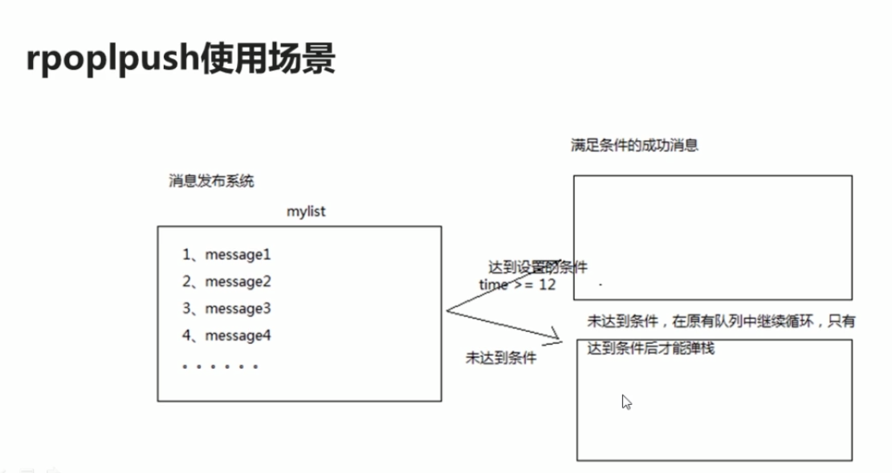

# Redis 入门
## NoSQL概述
What?
* NoSQL = Not Only SQL

Why?
* High performance - 高并发读写
* Huge Storage - 海量数据的高效率存储和访问
* High Scalability & High Availability - 高可扩展性和高可用性

### 四大分类
|分类|相关产品|典型应用|数据模型|优点|缺点|
|---|-------|-------|-------|---|---|
|键值(key-value)| Tokyo Cabinet / Tyrant, Redis, Voldemort, Berkeley DB| 内容缓存，主要用于处理大量数据的高访问负载|一系列键值对|快速查询|存储的数据缺少结构化|
|列存储 | Cassandra, HBase, Riak| 分布式的文件系统| 以列簇式存储，将同一列数据存在一起|查找速度快，可扩展性强，更容易进行分布式扩展|功能相对局限|
|文档数据库|CouchDB, MongoDB| Web应用(与key-value类似，Value是结构化的)|一系列键值对|数据结构要求不严格|查询性能不高，且缺乏统一的查询语法|
|图形数据库 |Neo4J, InfoGrid, Infinite Graph| 社交网络，推荐系统。专注于构建关系图谱|图结构|利用图结构的相关算法|需要对整个图做计算才能得出结构，不容易做分布式的集群方案|

### 特点
* 易扩展
* 灵活的数据模型
* 大数据量，高性能
* 高可用

## Redis概述
### 高性能键值对数据库，支持的键值数据类型：
* 字符串类型
* 列表类型
* 有序集合类型
* 散列类型
* 集合类型
### 应用场景
* 缓存
* 任务队列(秒杀，抢购)
* 网站访问统计
* 数据过期处理
* 应用排行榜
* 分布式集群架构中session的分离

# 使用Redis(Mac)
* 启动
`cd ~/app/redis-5.0.5`
`src/redis-server ./redis.conf`
* 查看进程
`ps -ef | grep -i redis`
* 停止
`./src/redis-server shutdown`

## Jedis入门
Jedis 是Redis官方首选的Java客户端安装包
A client library in Java for Redis

## Redis 的数据结构
### 物种数据类型
* **字符串(String)** - 常用
* 字符串列表(list)
* 有序字符串集合(sorted list)
* **哈希(hash)** - 常用
* 字符串集合(set)

### key定义的注意点
* 不要过长(<= 1024字节)
* 不要过短
* 统一命名规范

### String
* 二进制存储，存如和获取的数据相同
* Value最多可以容纳的数据长度是512M

#### 常用命令
* 赋值 `set key value`
* 删除 `del key`
* 扩展命令 `getset key new value` (return old value)
* 取值 `get key`
* 数值增减 
    * `incr num` **+ 1** (if num is not exist, it will set to 1.)
    * `decr num` **-1** (if num is not exist, it will set to -1.)
    * `incrby num 5` **+5**
    * `decrby num 5` **+5**
    * `append num 5` **字符串相加，返回字符串长度** (如果num不存在，会将num设成5)
  
### Hash
#### 常用命令
* 赋值 
    * `hset myhash username jack`
    * `hmset myhash2 username rose age 21`
* 取值
    * `hget myhash username` 取一个k-v pair
    * `hmget myhash username age` 取多个k-v pair
    * `hgetall myhash` 取所有k-v pair
    * `hkeys myhash` 返回所有key
    * `hvals myhash` 返回所有val
* 删除
    * `hdel myhash2 username age` 如果key不存在，返回0
    * `del myhash2` 删除所有k-v pair
* 增加数字
    * `hincrby myhash age 5` **+5**
    * `hdecrby myhash age 5` **-5**
* 判断存在
    * `hexists myhash username` 存在返1，不存在返0
    * `hlen myhash` 返回key的个数

### List
* ArrayList 使用数组方式
* LinkedList使用双向链接方式
#### 常用命令
* 两端添加
    * `lpush key a b c` 从左端一次push
    * `rpush key a b c` 从右端一次push
* 查看列表
    * `lrange mylist start end` end 可以是 -1，含义和Python相同
* 两端弹出，插入
    * `lpop key` 弹出后list中没有元素
    * `rpop key` 弹出后list中没有元素
    * `lpushx key val` 若key不存在，则不插入
    * `rpushx key val` 若key不存在，则不插入
* 获取列表某个元素
    * `llen key` 返回list长度

* 扩展命令
    * `lrem key val count val` 在key里删除前count个value = val (count < 0, 从右往左删，count = 0， 删除所有)
    * `lset key idx val` 在key中set第idx + 1个index 
    * `linsert mylist4 before val newVal`
    * `rpoplpush key1 key2` 把key1 的第一个元素pop出来push到key2的左边第一个

### Set
Set不允许出现重复元素
Set可包含的最大元素数量是4294967295
#### 常用命令
* 添加/删除元素
    * `sadd key val1 val2 ...` 添加
    * `srem key val1 val2 ...`
* 获得集合中的元素
    * `smembers key`
    * `sismember key val`
* 集合中的差集运算
    * `sdiff key1 key2`
  
* 集合中的交集运算
    * `sinter key1 key2`
* 集合中的并集运算
    * `sunion key1 key2`

* 扩展命令
    * `scard key` 返回val的个数
    * `srandmember key` 随机返回一个val
    * `sdiffstore newkey key1 key2` 将差集存在newkey中
    * `sinterstore newkey key1 key2` 将交集存在newkey中
    * `sunionstore newkey key1 key2` 将并集存在newkey中

### Sorted-Set
Sorted-Set和Set的区别
Sorted-Set的成员中在集合中的位置是有序的(游戏排名，微博热搜)

#### 常用命令
* 添加元素
    * `zadd key score1 val1 score2 val2 score3 val3`
* 获得元素
    * `zscore key val1` 返回val1的score
    * `zcard key` 返回key的个数
* 删除元素
    * `zrem key val`
    * `zremrangebyrank key start end` 删除从start到end的key (按排名)
    * `zremrangebyscore key start end` 删除从start到end的key (按分数)
* 范围查询
    * `zrange key start end (withscore)` 从小到大排名
    * `zrevrange key start end (withscore)` 从大到小排名
    * `zrevrangebyscore key start end (withscore) (limit 0 2)` 从大到小排名
* 扩展命令
    * `zincrby key score val` 修改分数 **+score**
    * `zcount key score1 score2` 返回[score1, score2]之间key的个数
## Redis的特性
### 多数据库
* 最多支持0～16号数据库
        `select 1`
* 移动某个key到另一个数据库
    ```
    select 0
    move key 1
    ```
### Redis事务
#### 常用指令
* 开启事务 `multi`
* 执行事务 `exec`
* 回滚事务 `discard`
#### 注意
* 在 `multi` 和 `exec` 之间的命令都会添加到队列中，直到执行 `exec` 才会做相应的改变。这些操作都被视为**事务里面**的相关操作
* 在事务中，如果某个命令执行失败，之后的命令仍会被执行
* 在事务开启**前**，如果客户端和服务器之间出现故障并导致断开，那么事务里的操作**不会**被服务器执行。
* 在事务开启**后**，如果客户端和服务器之间出现故障并导致断开，那么事务里的操作**会**被服务器执行。
## Redis持久化
* Redis将所有数据都存在内存中
* 需要将内存中的数据同步到硬盘上
### 两种持久化方式
* RDB
* AOF
### 持久化使用方式
#### RDB
* 在指定时间间隔内，将内存中的数据集快照写入磁盘
##### 优势
* 数据库只包含一个文件，对文件备份而言很好
* 方便恢复文件，因为可以很方便地讲一个文件压缩后再转移到其他的存储介质。
* 性能最大化(启动效率更高)。初始只要分叉处一些进程，再通过这些进程完成持久化工作
##### 劣势
* 无法保证高可用性(最大避免数据丢失)。因为系统一定会在定时持久化之前出现宕机的情况
* 数据集非常大的时候，整个系统会停止几百毫秒-1秒 
##### 配置
#### AOF
* 以日志的形式记录服务器的每一次操作
* 在每次服务器启动时，会重新读取该日志然后构建数据库
##### 优势
* 更高的数据安全性(每秒同步)
* 写入过程中出现宕机的现象也不会破坏日志中已经存在的内容
* 格式清晰，易于理解
####无持久化
* 通过配置禁用Redis的持久化功能
* 此时Redis作为缓存使用
#### 同时使用RDB和AOF